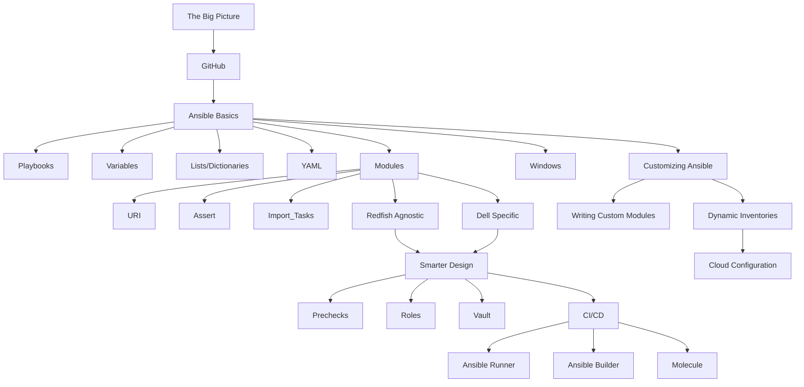

```mermaid
graph TD
    A["The Big Picture"] --> B["GitHub"]
    B --> C["Ansible Basics"]
    C --> D["Playbooks"]
    C --> E["Variables"]
    C --> F["Lists/Dictionaries"]
    C --> G["YAML"]
    C --> H["Modules"]
    C --> X["Windows"]
    C --> Y["Customizing Ansible"]

    H --> I["URI"]
    H --> J["Assert"]
    H --> K["Import_Tasks"]
    H --> L["Redfish Agnostic"]
    H --> M["Dell Specific"]

    L --> N["Smarter Design"]
    M --> N

    N --> O["Prechecks"]
    N --> P["Roles"]
    N --> Q["Vault"]
    N --> R["CI/CD"]

    R --> S["Ansible Runner"]
    R --> T["Ansible Builder"]
    R --> U["Molecule"]

    Y --> V["Writing Custom Modules"]
    Y --> W["Dynamic Inventories"]

    W --> Z["Cloud Configuration"]
```
