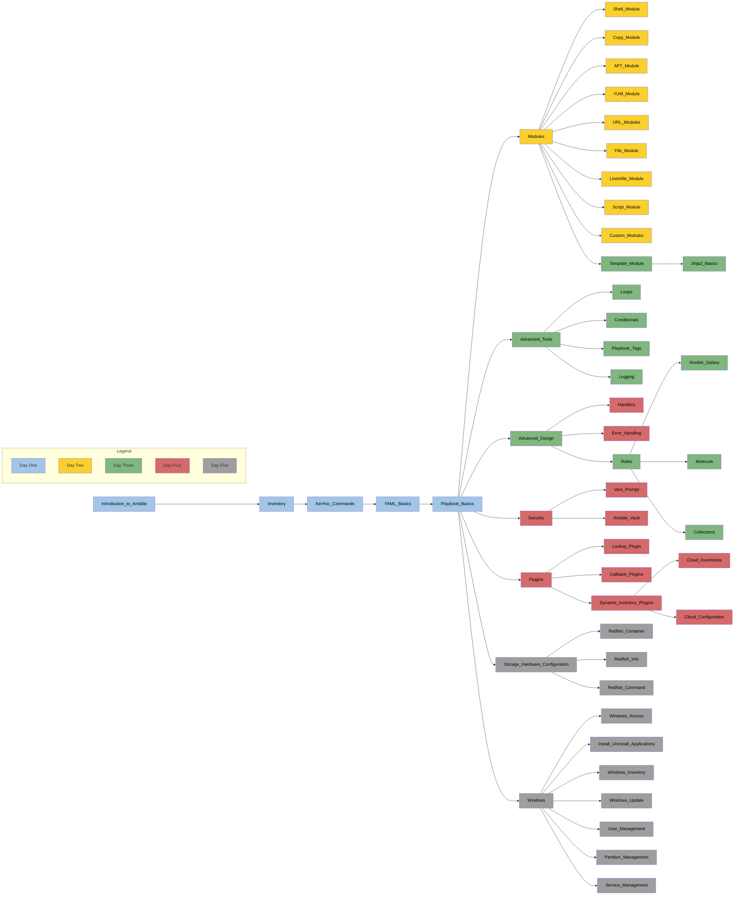

```mermaid
flowchart LR
    Introduction_to_Ansible --> Inventory
    style Introduction_to_Ansible fill:#A1C6E7,color:black
    Inventory --> Ad-Hoc_Commands
    style Inventory fill:#A1C6E7,color:black
    Ad-Hoc_Commands --> YAML_Basics
    style Ad-Hoc_Commands fill:#A1C6E7,color:black
    YAML_Basics --> Playbook_Basics
    style YAML_Basics fill:#A1C6E7,color:black

    Playbook_Basics --> Modules
    style Playbook_Basics fill:#A1C6E7,color:black
    Modules --> Shell_Module
    style Modules fill:#FAD02E,color:black
    Modules --> Copy_Module
    style Shell_Module fill:#FAD02E,color:black
    Modules --> APT_Module
    style Copy_Module fill:#FAD02E,color:black
    Modules --> YUM_Module
    style APT_Module fill:#FAD02E,color:black
    Modules --> URL_Modules
    style YUM_Module fill:#FAD02E,color:black
    Modules --> File_Module
    style URL_Modules fill:#FAD02E,color:black
    Modules --> Lineinfile_Module
    style File_Module fill:#FAD02E,color:black
    Modules --> Script_Module
    style Lineinfile_Module fill:#FAD02E,color:black
    Modules --> Custom_Modules
    style Script_Module fill:#FAD02E,color:black
    Modules --> Template_Module
    style Custom_Modules fill:#FAD02E,color:black
    Template_Module --> Jinja2_Basics
    style Template_Module fill:#7FB77E,color:black
    style Jinja2_Basics fill:#7FB77E,color:black

    Playbook_Basics --> Advanced_Tools
    style Advanced_Tools fill:#7FB77E,color:black
    Advanced_Tools --> Loops
    style Loops fill:#7FB77E,color:black
    Advanced_Tools --> Conditionals
    style Conditionals fill:#7FB77E,color:black
    Advanced_Tools --> Playbook_Tags
    style Playbook_Tags fill:#7FB77E,color:black
    Advanced_Tools --> Logging
    style Logging fill:#7FB77E,color:black

    Playbook_Basics --> Advanced_Design
    style Advanced_Design fill:#7FB77E,color:black
    Advanced_Design --> Handlers
    style Handlers fill:#D46A6A,color:black
    Advanced_Design --> Error_Handling
    style Error_Handling fill:#D46A6A,color:black
    Advanced_Design --> Roles
    style Roles fill:#7FB77E,color:black
    Roles --> Ansible_Galaxy
    style Ansible_Galaxy fill:#7FB77E,color:black
    Roles --> Molecule
    style Molecule fill:#7FB77E,color:black
    Roles --> Collections
    style Collections fill:#7FB77E,color:black

    Playbook_Basics --> Security
    style Security fill:#D46A6A,color:black
    Security --> Vars_Prompt
    style Vars_Prompt fill:#D46A6A,color:black
    Security --> Ansible_Vault
    style Ansible_Vault fill:#D46A6A,color:black

    Playbook_Basics --> Plugins
    style Plugins fill:#D46A6A,color:black
    Plugins --> Lookup_Plugin
    style Lookup_Plugin fill:#D46A6A,color:black
    Plugins --> Callback_Plugins
    style Callback_Plugins fill:#D46A6A,color:black
    Plugins --> Dynamic_Inventory_Plugins
    style Dynamic_Inventory_Plugins fill:#D46A6A,color:black

    Dynamic_Inventory_Plugins --> Cloud_Inventories
    style Cloud_Inventories fill:#D46A6A,color:black
    Dynamic_Inventory_Plugins --> Cloud_Configuration
    style Cloud_Configuration fill:#D46A6A,color:black

    Playbook_Basics --> Storage_Hardware_Configuration
    style Storage_Hardware_Configuration fill:#9E9E9E,color:black
    Storage_Hardware_Configuration --> Redfish_Container
    style Redfish_Container fill:#9E9E9E,color:black
    Storage_Hardware_Configuration --> Redfish_Info
    style Redfish_Info fill:#9E9E9E,color:black
    Storage_Hardware_Configuration --> Redfish_Command
    style Redfish_Command fill:#9E9E9E,color:black

    Playbook_Basics --> Windows
    style Windows fill:#9E9E9E,color:black
    Windows --> Windows_Access
    style Windows_Access fill:#9E9E9E,color:black
    Windows --> Install_Uninstall_Applications
    style Install_Uninstall_Applications fill:#9E9E9E,color:black
    Windows --> Windows_Inventory
    style Windows_Inventory fill:#9E9E9E,color:black
    Windows --> Windows_Update
    style Windows_Update fill:#9E9E9E,color:black
    Windows --> User_Management
    style User_Management fill:#9E9E9E,color:black
    Windows --> Partition_Management
    style Partition_Management fill:#9E9E9E,color:black
    Windows --> Service_Management
    style Service_Management fill:#9E9E9E,color:black

    subgraph Legend
        L1["<span style=&quot;color:black;&quot;>Day One</span>"]
        style L1 fill:#A1C6E7
        L2["<span style=&quot;color:black;&quot;>Day Two</span>"]
        style L2 fill:#FAD02E
        L3["<span style=&quot;color:black;&quot;>Day Three</span>"]
        style L3 fill:#7FB77E
        L4["<span style=&quot;color:black;&quot;>Day Four</span>"]
        style L4 fill:#D46A6A
        L5["<span style=&quot;color:black;&quot;>Day Five</span>"]
        style L5 fill:#9E9E9E
    end

```
