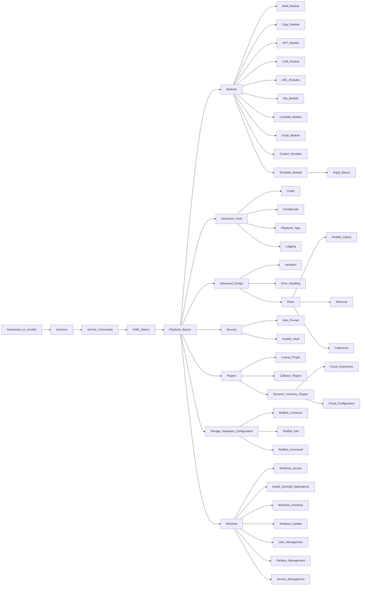

```mermaid
flowchart LR
    Introduction_to_Ansible --> Inventory
    Inventory --> Ad-Hoc_Commands
    Ad-Hoc_Commands --> YAML_Basics
    YAML_Basics --> Playbook_Basics

    Playbook_Basics --> Modules
    Modules --> Shell_Module
    Modules --> Copy_Module
    Modules --> APT_Module
    Modules --> YUM_Module
    Modules --> URL_Modules
    Modules --> File_Module
    Modules --> Lineinfile_Module
    Modules --> Script_Module
    Modules --> Custom_Modules
    Modules --> Template_Module
    Template_Module --> Jinja2_Basics

    Playbook_Basics --> Advanced_Tools
    Advanced_Tools --> Loops
    Advanced_Tools --> Conditionals
    Advanced_Tools --> Playbook_Tags
    Advanced_Tools --> Logging

    Playbook_Basics --> Advanced_Design
    Advanced_Design --> Handlers
    Advanced_Design --> Error_Handling
    Advanced_Design --> Roles
    Roles --> Ansible_Galaxy
    Roles --> Molecule
    Roles --> Collections

    Playbook_Basics --> Security
    Security --> Vars_Prompt
    Security --> Ansible_Vault

    Playbook_Basics --> Plugins
    Plugins --> Lookup_Plugin
    Plugins --> Callback_Plugins
    Plugins --> Dynamic_Inventory_Plugins

    Dynamic_Inventory_Plugins --> Cloud_Inventories
    Dynamic_Inventory_Plugins --> Cloud_Configuration

    Playbook_Basics --> Storage_Hardware_Configuration
    Storage_Hardware_Configuration --> Redfish_Container
    Storage_Hardware_Configuration --> Redfish_Info
    Storage_Hardware_Configuration --> Redfish_Command

    Playbook_Basics --> Windows
    Windows --> Windows_Access
    Windows --> Install_Uninstall_Applications
    Windows --> Windows_Inventory
    Windows --> Windows_Update
    Windows --> User_Management
    Windows --> Partition_Management
    Windows --> Service_Management

```
